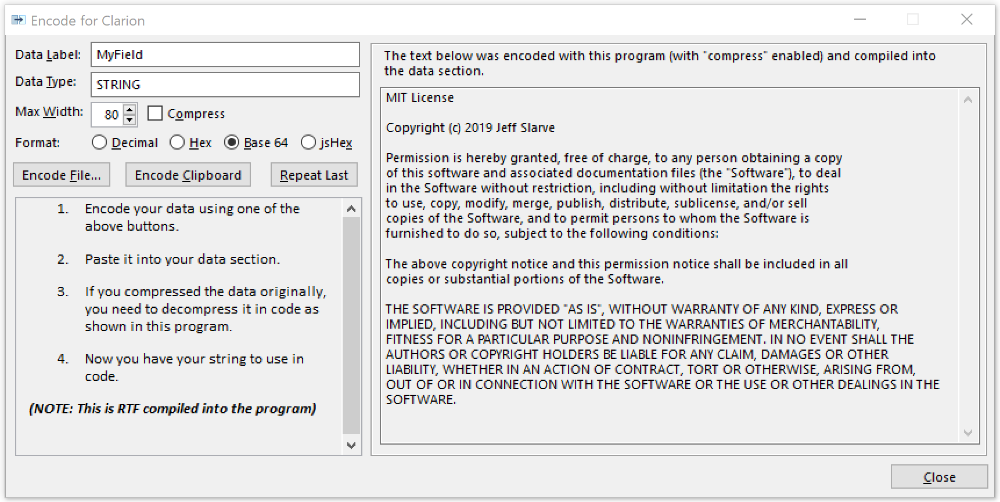
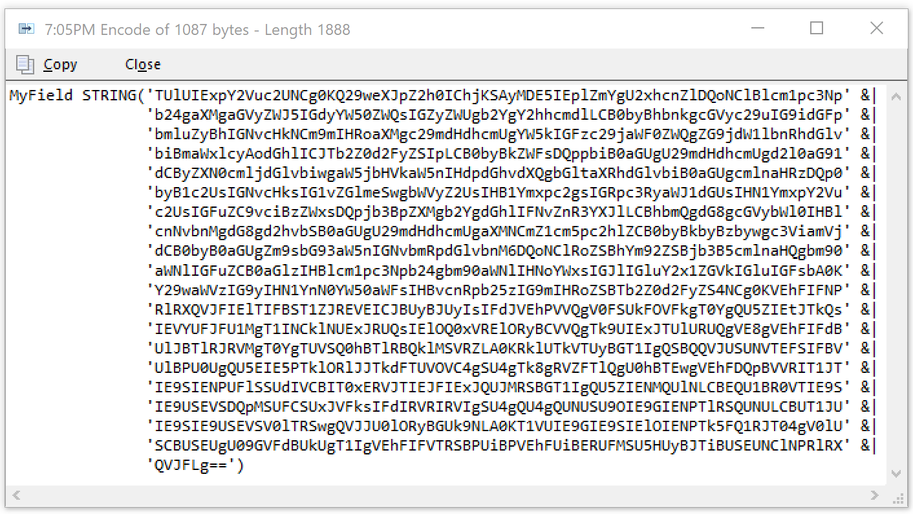

# Data to Clarion Encoder

Forked from jSlarve

Ever had to add formatted text to your Clarion application's data section?
It's kind of a PITB. This program makes it easy to encode (and compress if desired) text or binary data and compile it directly into your program.

## Usage 
Please read the screen on the program.

The below window pops up for each encode. Press the copy button to place the code lines on the clipboard. Example shown in Base 64.

## Prerequisites

If you wish to compile the executable or utilize the "compress" option, you need Capesoft StringTheory.
https://www.capesoft.com/accessories/StringTheorysp.htm

If you do NOT use the compress option, you can use the encoded strings directly in your program without StringTheory.

